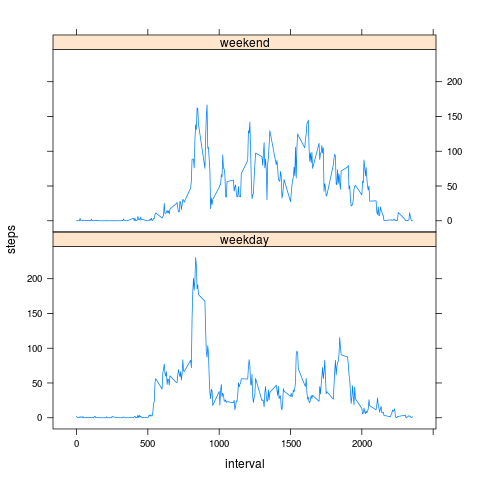

# Reproducible Research: Peer Assessment 1


## Loading and preprocessing the data
### Reading the dataset


```r
Sys.setlocale(category = "LC_TIME", locale = "C")
fileUrl <- "https://d396qusza40orc.cloudfront.net/repdata%2Fdata%2Factivity.zip"
fileName <- "activity.zip"
imagesFolder <- "figure"

if(!file.exists(fileName)){
  download.file(fileUrl,fileName, mode = "wb", method="curl")
}

unzip(fileName)

datasetFileName <- "activity.csv"
dataset <- read.table(datasetFileName, sep = ",", header = TRUE, stringsAsFactors= F)
dataset$date <- as.Date(dataset$date, format = "%Y-%m-%d")
dataset$steps <- as.numeric(dataset$steps)
dataset$interval <- as.numeric(dataset$interval)
```

### Dataset sample


```r
head(dataset)
```

```
##   steps       date interval
## 1    NA 2012-10-01        0
## 2    NA 2012-10-01        5
## 3    NA 2012-10-01       10
## 4    NA 2012-10-01       15
## 5    NA 2012-10-01       20
## 6    NA 2012-10-01       25
```

## What is mean total number of steps taken per day?


```r
totalStepsByDay <- sqldf("select date, sum(steps) steps from dataset where steps is not null group by date order by date")
png(paste(imagesFolder, "totalStepsPerDayHistOriginal.png", sep = "/"))
hist(totalStepsByDay$steps, col="red", main = "Number of steps taken each day", xlab = "Steps")
dev.off()
```
 

Mean of the total number of steps taken per day


```r
mean(totalStepsByDay$steps, na.rm = TRUE)
```

```
## [1] 10766.19
```

Median of the total number of steps taken per day


```r
median(totalStepsByDay$steps, na.rm = TRUE)
```

```
## [1] 10765
```

## What is the average daily activity pattern?


```r
avgStepsPerInterval <- sqldf("select interval, avg(steps) steps from dataset where steps is not null group by interval order by interval")
png(paste(imagesFolder, "avgStepsPerInterval.png", sep = "/"))
plot(avgStepsPerInterval$interval, avgStepsPerInterval$steps, type="l", xlab = "Interval", ylab="Average steps count")
dev.off()
```
 

### 5-minute interval with the maximum number of steps


```r
avgStepsPerInterval$interval[avgStepsPerInterval$steps == max(avgStepsPerInterval$steps)]
```

```
## [1] 835
```

## Imputing missing values
Total count of NA steps values

```r
sqldf("select count(*) count from dataset where steps is null")[, "count"]
```

```
## [1] 2304
```

Replacing all NA steps values with the average value in the according interval

```r
datasetWithoutNA <- sqldf(c("update dataset set steps = (select steps from avgStepsPerInterval where avgStepsPerInterval.interval = dataset.interval) where steps is null", "select * from main.dataset"))
```

### Updated steps spreading histogram

```r
totalStepsByDay <- sqldf("select date, sum(steps) steps from datasetWithoutNA where steps is not null group by date order by date")
png(paste(imagesFolder, "totalStepsByDay.png", sep = "/"))
hist(totalStepsByDay$steps, col="red", main = "Number of steps taken each day", xlab = "Steps")
dev.off()
```
 

Mean of the total number of steps taken per day


```r
mean(totalStepsByDay$steps, na.rm = TRUE)
```

```
## [1] 10766.19
```

Median of the total number of steps taken per day


```r
median(totalStepsByDay$steps, na.rm = TRUE)
```

```
## [1] 10766.19
```

## Are there differences in activity patterns between weekdays and weekends?

### Difference between weekday and weekend sensor data

```r
datasetWithoutNA$"day" <- weekdays(datasetWithoutNA$"date")

datasetWithoutNA <- sqldf(c("update datasetWithoutNA set day = 'weekend' where day in ('Saturday', 'Sunday')", "select * from main.datasetWithoutNA"))
datasetWithoutNA <- sqldf(c("update datasetWithoutNA set day = 'weekday' where day <> 'weekend'", "select * from main.datasetWithoutNA"))

groupedByWeekday <- aggregate(steps ~ interval + day, data = datasetWithoutNA, mean)

png("figure/weekendsPlot.png")
xyplot(steps ~ interval | day, data = groupedByWeekday, layout=c(1,2), type = "l")
dev.off()
```

